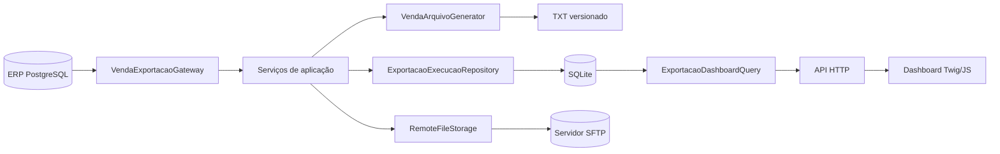
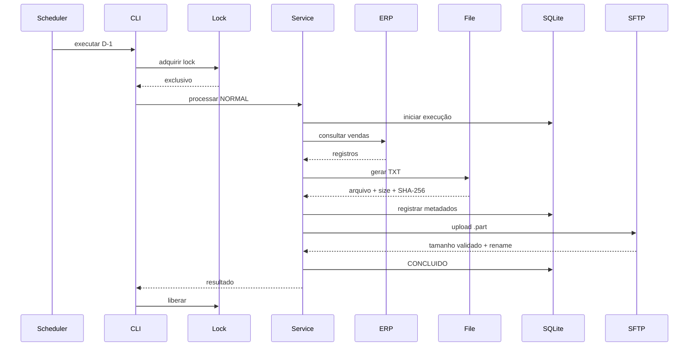

# Arquitetura

## Objetivos

A arquitetura procura equilibrar quatro características:

1. **simplicidade operacional** para uma integração diária;
2. **rastreabilidade** suficiente para auditoria e diagnóstico;
3. **isolamento de infraestrutura**, permitindo substituir ERP, formato ou transporte;
4. **portabilidade** entre Windows e Linux.

O sistema não foi desenhado como um framework genérico de ETL. O foco é manter um fluxo de exportação pequeno, explícito e seguro.

## Visão de componentes



## Camadas

### Domain

Contém conceitos que não deveriam depender de banco, framework web ou SFTP.

Exemplos:

```text
src/Modules/Exportacao/Vendas/Domain/
├── Enum/
│   ├── StatusExportacao.php
│   └── TipoExecucao.php
└── Exception/
```

`TipoExecucao` diferencia:

- `NORMAL`
- `REPROCESSAMENTO`
- `REENVIO`

`StatusExportacao` representa a máquina de estados operacional.

### Application

Orquestra casos de uso e depende de contratos.

```text
Application/
├── Contracts/
├── DTO/
└── Services/
```

Casos de uso principais:

- `ConsultarVendasService`
- `GerarArquivoVendasService`
- `EnviarArquivoVendasService`
- `ProcessarExportacaoVendasService`
- `ReenviarExportacaoVendasService`
- `ReprocessarExportacaoVendasService`

Contratos importantes:

```text
VendaExportacaoGateway
VendaArquivoGenerator
ExportacaoExecucaoRepository
ExportacaoDashboardQuery
RemoteFileStorage
```

Essas interfaces reduzem o acoplamento com VRMaster/PostgreSQL, TXT, SQLite e SFTP.

### Infrastructure

Implementa detalhes concretos.

Exemplos:

```text
VrMasterVendaExportacaoGateway
VendaTxtGenerator
VendaTxtFormatter
SqliteExportacaoExecucaoRepository
SqliteExportacaoDashboardQuery
PhpseclibRemoteFileStorage
PostgreSqlConnection
SqliteConnection
FileProcessLock
```

## Fluxo NORMAL



## Idempotência

Existe uma restrição única parcial no SQLite para impedir mais de uma execução `NORMAL` ativa/concluída para a mesma data de movimento.

Estados que bloqueiam outra execução `NORMAL`:

```text
AGUARDANDO
CONSULTANDO
GERANDO_ARQUIVO
VALIDANDO
ENVIANDO
CONFIRMANDO_ENVIO
CONCLUIDO
```

Execuções `FALHOU` ou `CANCELADO` não impedem uma nova tentativa normal.

Reenvios e reprocessamentos são novas execuções e ficam vinculados por `execucao_origem_id`.

## Lock de processo

O projeto usa `FileProcessLock` sobre:

```text
storage/runtime/export-sales-daily.lock
```

O lock evita concorrência entre:

- agendamento automático;
- reenvio manual;
- reprocessamento manual.

A rotina automática aguarda até 15 minutos por uma operação manual em andamento. As operações manuais falham rapidamente quando o lock já está ocupado.

O arquivo de lock não precisa ser removido a cada execução; o lock do sistema operacional mantido pelo descritor aberto é a autoridade.

## Geração de arquivo

O arquivo é gerado em diretório versionado por execução, preservando auditoria e evitando que um reprocessamento altere fisicamente a versão anterior.

Conceitualmente:

```text
storage/exports/YYYY/MM/execucao-{id}/arquivo.txt
```

O gerador produz:

- quantidade de registros;
- tamanho em bytes;
- SHA-256.

A escrita local usa arquivo temporário antes da finalização.

## SFTP atômico

O fluxo remoto evita disponibilizar um arquivo incompleto com o nome final:

```text
arquivo.txt.part
      ↓ upload completo
comparação de tamanho
      ↓
rename
      ↓
arquivo.txt
```

A host key SSH é validada antes do envio de usuário/senha.

Por segurança, o storage remoto não sobrescreve silenciosamente um arquivo final já existente.

## Persistência local

O SQLite possui duas tabelas principais:

### `exportacao_execucao`

Mantém o estado agregado de cada execução.

### `exportacao_execucao_evento`

Mantém a timeline de alterações de status e mensagens operacionais.

Essa separação permite ao dashboard exibir tanto o estado atual quanto a história da execução.

## HTTP e dashboard

O browser recebe o shell HTML via Twig e consulta APIs JSON separadas.

```text
GET  /
GET  /api/dashboard/resumo
GET  /api/exportacoes
GET  /api/exportacoes/{id}
POST /api/exportacoes/{id}/reenviar
POST /api/exportacoes/{id}/reprocessar
```

As operações de escrita exigem `POST`, conteúdo JSON e `X-Requested-With: XMLHttpRequest`, além do lock de processo. Isso não substitui autenticação. O projeto atual deve ser mantido em ambiente local ou rede interna confiável.

## Pontos de extensão

### Outro ERP

Implemente:

```text
VendaExportacaoGateway
```

A implementação de referência é `VrMasterVendaExportacaoGateway`.

### Outro formato de arquivo

Implemente:

```text
VendaArquivoGenerator
```

A implementação atual utiliza `VendaTxtGenerator` + `VendaTxtFormatter`.

### Outro transporte

Implemente:

```text
RemoteFileStorage
```

A implementação atual utiliza SFTP com phpseclib.

## Princípios adotados

- serviços pequenos e orientados a caso de uso;
- dependência de contratos entre aplicação e infraestrutura;
- histórico imutável por execução;
- falhas explícitas;
- sem sobrescrita silenciosa de arquivo remoto;
- sem necessidade de um servidor web para o worker diário;
- dashboard desacoplado da execução automática.
